 ### Book Management API

[URL OF GITHUB](https://github.com/ankitofficial00/Book-Management-Application)

This is a simple Node.js API for managing book entries, including user authentication, CRUD operations for books, filtering books by author or publication year, and basic security measures.

 ###### Getting Started

To get started with this project, follow these steps:

 1. ######  install dependencies
       npm install 

2. ###### create a package.json file
    npm init

 ##### Package Documentation

Express: Fast, unopinionated, minimalist web framework for Node.js.

Mongoose: MongoDB object modeling tool designed to work in an asynchronous environment.

Body-parser: Parse incoming request bodies in a middleware before your handlers.

Bcrypt: Library for hashing passwords.

Jsonwebtoken: JSON Web Token implementation for authentication.

Dotenv: Loads environment variables from a .env file into process.env.

3. ###### Set up environment variables:
   create .env file in the root directory and add the following variable :
   PORT : preferred port number
   MONGODB_URI : mongoDB connection string 
   JWT_SECRET : JWT secret key string
   JWT_EXPIRY : JWT expiry time 

4. ######  Run the server 
    npm run dev 
    dev is script  added in scripts section of package.json which runs nodemons src/index.js command

######  FOLDER STRUCTURE --MVC(MODAL VIEW CONTROLLER )

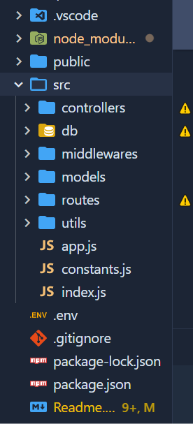

  public
  images : to store the static files like images 

   src
 models/: Contains Mongoose models for User and Book schema  

 routes/: Contains route handlers for authentication and book management endpoints.

middlewareS/: Contains custom middleware functions (e.g., authentication).

index.js: Entry point of the application where Express server is initialized.

.env: Environment variables file for storing sensitive information like database connection string and JWT secret key.

package.json: File containing project metadata and dependencies.

README.md: Project documentation file containing instructions on setting up and using the API.

db: this is used to connect the our server with the database.
utils: it contain the utility code.

constants.js : it contains the db name and constants.
app.js : it contains the how to handle data come from frontend, format of data and also help to encoded the url .

##### Routes:
/api/v1/users   ---  user route
/api/v1/books    ---  books route

   ###### User Authentication

User authentication is implemented using JWT (JSON Web Tokens). When a user registers or logs in, a JWT token is generated and returned. This token needs to be included in the header of subsequent requests to access protected endpoints. The token is validated using middleware (middlewares/authenticateToken.js) before processing the request.

 #### API Documentation
###### Authentication Endpoints
1. ###### Register User

    URL: /api/auth/v1/users/register
    Method: POST
    Description: Register a new user with email and password and userName and fullName
    Request Body:
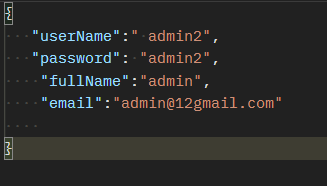

Response:
    200 OK: User registered successfully.
    400 Bad Request: Invalid request body or email already exists.
  
  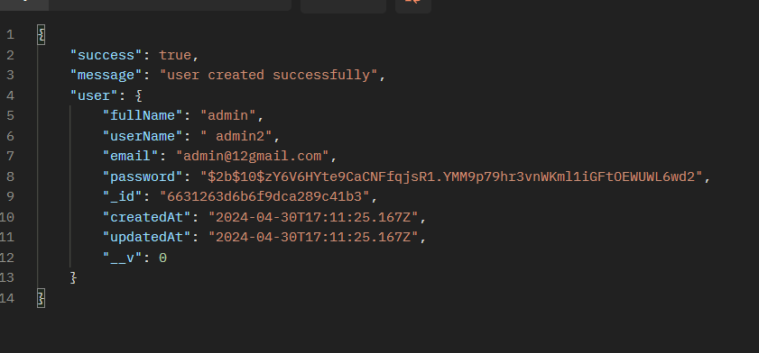

2. ###### Login User

    URL: /api/v1/users/login
    Method: POST
    Description: Log in an existing user.
    Request Body:
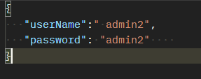

Response:
200 OK: Login successful, returns JWT token.
    401 Unauthorized: Invalid credentials.

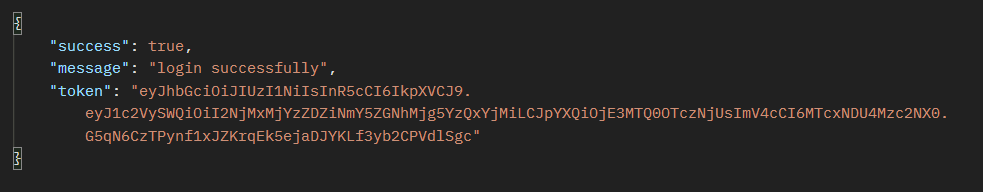

3. ###### logout User

    URL: /api/auth/v1/users/logout
    Method: GET
    Description: we use middleware to check that user is logged  in before calling this route. If the user is not logged in, they will be redirected to login.

Response:
 200 OK: Login successful, returns JWT token.
    401 Unauthorized: Invalid credentials.

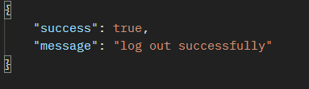

 #### Book Management Endpoints
1. ##### Create Book

    URL: /api/v1/books/add
    Method: POST
    Description: Create a new book entry.
    Request Body:

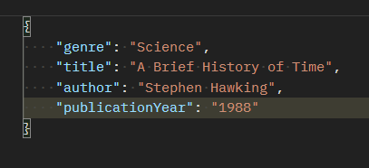

Headers:
auth-token: JWT token obtained after login.

Response:
200 OK: Book created successfully.
401 Unauthorized: Authentication token missing or invalid.

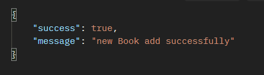

2. ##### Get All Books

    URL: /api/v1/books/readAll
    Method: GET
    Description: Get a list of all books.

Response:
200 OK: Returns an array of book objects.
401 Unauthorized: Authentication token missing or invalid.

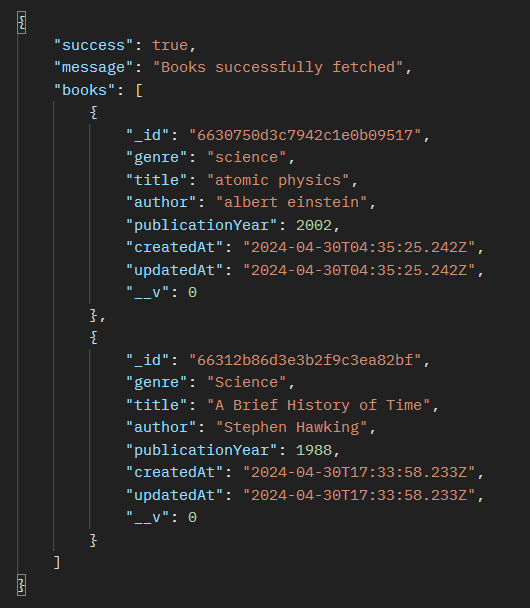

3. ##### Get Books by Author

    URL: /api/v1/books/filter?author=Author Name
    Method: GET
    Description: Get a list of books by a specific author.
Response:
200 OK: Returns an array of book objects.
401 Unauthorized: Authentication token missing or invalid.

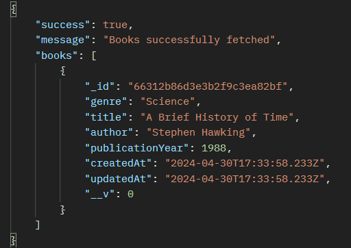

4. ##### Get Books by Publication Year

    URL: /api/books/filter?publicationYear=2002
    Method: GET
    Description: Get a list of books published in a specific year.
    Response:
200 OK: Returns an array of book objects.
    401 Unauthorized: Authentication token missing or invalid.

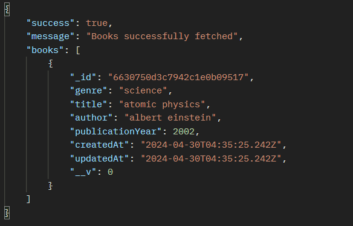

5. ##### Update Book

    URL: /api/books/update/:id
    Method: PUT
    Description: Update a book entry by ID.
    Request Body:

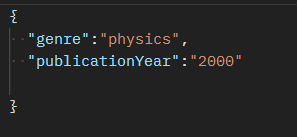

Headers:
auth-token: JWT token obtained after login.
Response:
200 OK: Book updated successfully.
    401 Unauthorized: Authentication token missing or invalid.
    404 Not Found: Book with given ID not found.

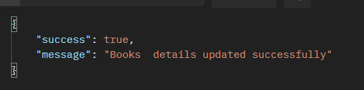

6. ##### Delete Book

    URL: /api/books/delete/:id
    Method: DELETE
    Description: Delete a book entry by ID.
    Headers:
        auth-token: JWT token obtained after login.
    Response:
        200 OK: Book deleted successfully.
        401 Unauthorized: Authentication token missing or invalid.
        404 Not Found: Book with given ID not found.

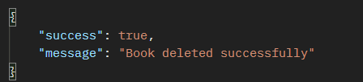

 ##### Testing with Postman:
Importing the Collection:
        Create a Postman Collection for your API endpoints.
        Add requests for each API endpoint (e.g., Register User, Login User, Create Book, Get All Books, etc.) to the collection.

Environment Variables:
        Set up environment variables for dynamic values like base URL, authentication token, etc., to streamline testing across different environments (e.g., development, staging, production).

Testing Endpoints:
        Send requests to each API endpoint with different input parameters and authentication tokens (if required).
        Verify the responses to ensure they match the expected behavior.

Assertions:
        Use Postman's testing capabilities to add assertions to your requests. Assertions help validate the response data, status codes, headers, etc., automatically during testing.

Automated Tests:
        Write automated tests using JavaScript (Postman Scripts) to perform more complex validations, data manipulation, and workflow testing.

###### Future Improvements: 
To enhance the application further, you can consider implementing additional features and improvements such as:

Validation: Implement input validation for request bodies to ensure data integrity and security.
Error Handling: Enhance error handling to provide meaningful error messages and status codes for different scenarios.

Pagination: Add pagination support to handle large datasets efficiently when retrieving books.
Sorting: Implement sorting options for books by title, author, or publication year.

Authorization: Extend user authentication to include role-based access control (RBAC) for managing user permissions.

Unit Testing: Write unit tests using frameworks like Mocha and Chai to ensure the reliability of your codebase.

Logging: Integrate logging mechanisms to record API usage, errors, and other relevant information for monitoring and debugging purposes.

Rate Limiting: Implement rate limiting to prevent abuse or misuse of your API endpoints.
Swagger Documentation: Generate API documentation automatically .

Containerization: Dockerize your application for easier deployment and scalability.

Continuous Integration/Continuous Deployment (CI/CD): Set up CI/CD pipelines to automate the testing, building, and deployment processes.

Authentication with OAuth2: Implement OAuth2 authentication for integrating with third-party services or allowing users to authenticate using social media accounts.

Enhanced Filtering: Allow filtering books by multiple criteria simultaneously (e.g., author and publication year).

File Uploads: Support file uploads for book covers or additional attachments.

Internationalization: Add support for multiple languages by implementing internationalization (i18n) features.

Data Caching: Introduce caching mechanisms to improve the performance of frequently accessed data.
Webhooks: Implement webhooks for real-time notifications or event-driven integrations.

GraphQL: Consider migrating to GraphQL for more flexible and efficient data querying.

Security Headers: Set up security headers to protect against common web vulnerabilities (e.g., XSS, CSRF).

Monitoring and Alerts: Configure monitoring tools and alerts to proactively identify and address issues in production.

## Thank you